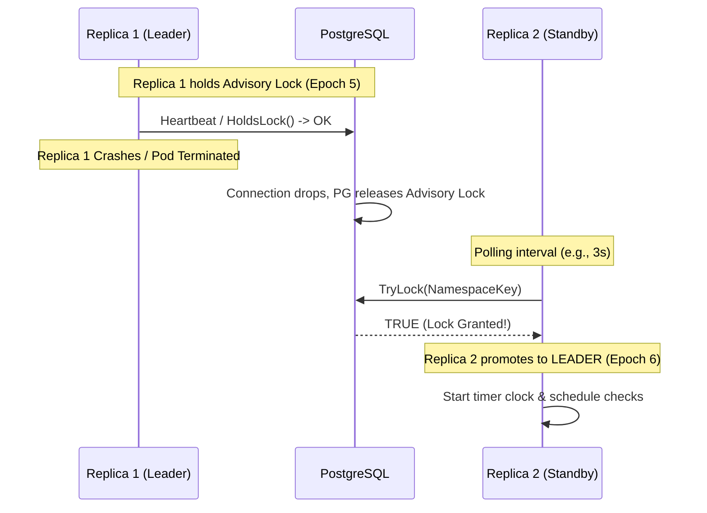

# 👑 Leader Election & Failover Architecture

`d-cron` uses a **Single Active Leader** execution model. At any given moment across `N` running replicas of your application, exactly **one** node acts as the active **Leader**, while the remaining `N-1` nodes remain in **Standby** mode.

---

## 🔄 State Machine & Life Cycle

Every `d-cron` instance operates an internal state machine transitioning between three primary states:

```
        ┌──────────────┐
        │   INIT /     │
        │   STARTUP    │
        └──────┬───────┘
               │
               ▼
┌──────────────────────────────┐       Acquire Advisory Lock      ┌──────────────────────────────┐
│                              ├─────────────────────────────────►│                              │
│           STANDBY            │                                  │            LEADER            │
│  - Polls Lock Periodically   │◄─────────────────────────────────┤  - Runs Cron Timer Clock     │
│  - Clock Suspended           │       Lost Lock / Network Loss   │  - Dispatches Scheduled Jobs │
│                              │                                  │  - Increments Epoch Token    │
└──────────────────────────────┘                                  └──────────────────────────────┘
```

### 1. Standby State
- The instance connects to Postgres and periodically attempts to acquire the advisory lock key using `TryLock`.
- The cron timer clock is **suspended**. No scheduled jobs are triggered on Standby nodes.
- CPU consumption is virtually zero.

### 2. Leader State
- When `TryLock` returns `true`, the instance transitions to **Leader**.
- The instance increments its internal monotonic **Leader Epoch** (e.g. from Epoch 4 to Epoch 5).
- The internal timer engine wakes up, evaluates all job cron schedules, and dispatches job routines when triggers fire.
- A background health check routine regularly verifies that the underlying session connection remains alive and `HoldsLock` returns `true`.

---

## ⚡ Failover Flow Sequence

What happens when the active Leader node dies or is terminated during a rolling deployment?



1. **Leader Crash**: Replica 1 goes down. Its TCP connection to PostgreSQL breaks.
2. **Lock Release**: PostgreSQL automatically drops session advisory locks bound to that connection.
3. **Standby Promotion**: Within the configured polling interval (default: 3–5 seconds), Replica 2's `TryLock` succeeds.
4. **Epoch Increment**: Replica 2 increments epoch count to 6 and starts triggering scheduled jobs seamlessly.

---

## ⏱️ Leader Election Configuration Options

You can tune leader election behavior using configuration options during `dcron.New`:

```go
scheduler, err := dcron.New(
    db,
    dcron.WithNamespace("orders-service"),
    dcron.WithInstanceID("pod-orders-7f9b8-x2k9l"),
    
    // Polling interval for Standby nodes attempting to acquire leadership
    dcron.WithPollInterval(3 * time.Second),
    
    // Leader verification check interval
    dcron.WithHeartbeatInterval(1 * time.Second),
)
```

| Option | Default | Purpose |
| :--- | :--- | :--- |
| `WithPollInterval` | `3s` | Determines maximum failover detection latency when a Leader node drops. |
| `WithHeartbeatInterval` | `1s` | Frequency at which the active Leader confirms its advisory lock session status. |
| `WithInstanceID` | Hostname / PID | Unique human-readable identifier for auditing and metrics tags. |
